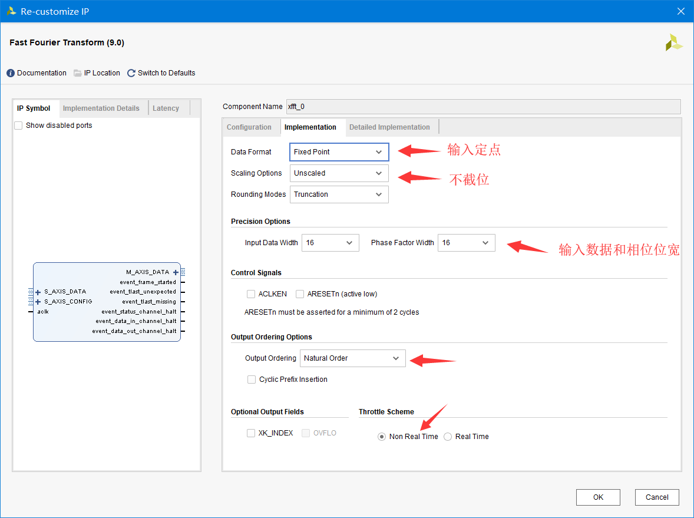
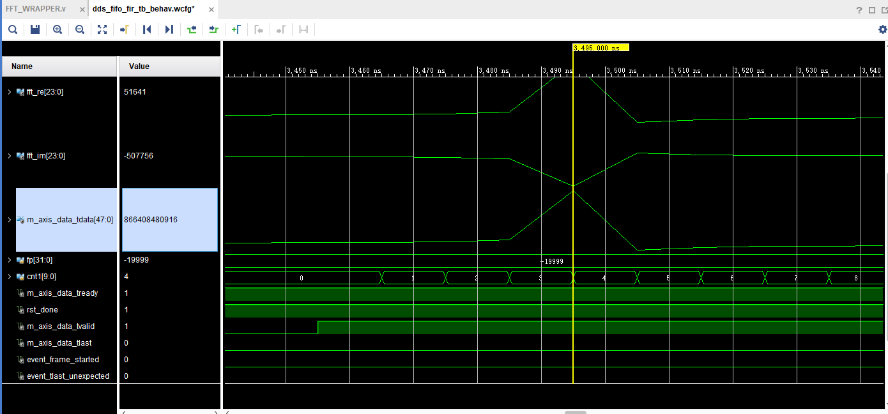

# FFT-xilinx-ipcore
The implemention &amp; test code for xilinx fft ip core(v 9.0), standard AIX4, for future reference

## IP Core Configuration 

* 配置(按照图中)
  * 对于数据位宽的配置有一些疑问(设置输入数据位宽为14,IP核中的输入数据仍然为16位)
  * 由于输入数据是signed形式,假设有一个14位的数据
    * 如果有IP核16位数据,理论上需要进行位拓展 (将最高位(符号位)往高位复制)
    * 如果IP核时14位数据,是否只需要输入14位数据,最高位空着(?)
  
  
## Timing Diagram

基本按照AXI4协议,tvalid拉高表示数据有效,给了N个数据之后,给一个tlast表示是最后一个数据

## Usage
* fft_wrapper.v (FFT_WRAPPER.v) 完成了对FFT核的配置
* fft_wrapper_tb.v 从本地文件中读取出数据进行FFT之后的结果存在本地文件中
* 其他一些模块是与其他东西的接口

## Tips
* FFT模块的后级ready信号(m_axis_tready)一定要拉高,不然会出错
* FFT模块的所有控制信号在一开始rst的时候一定要给初值(如果为Z或者是X)会导致仿真错误无法执行
